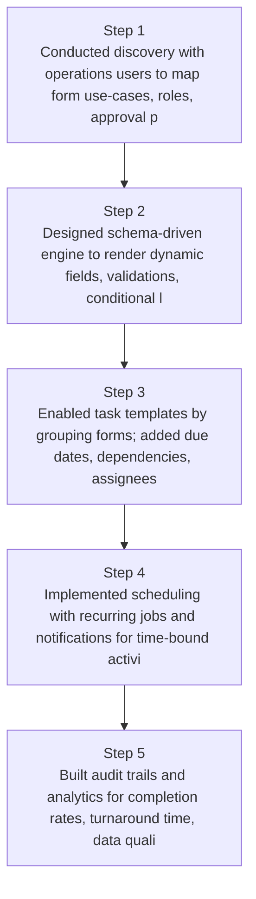
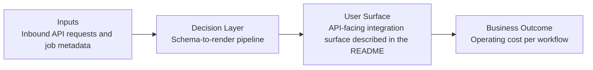

# No-Code Logistics Form Builder Diagrams

Generated on 2026-04-26T04:29:37Z from README narrative plus project blueprint requirements.

## Form builder architecture

## Schema-to-render pipeline

## Evidence Gap Map

